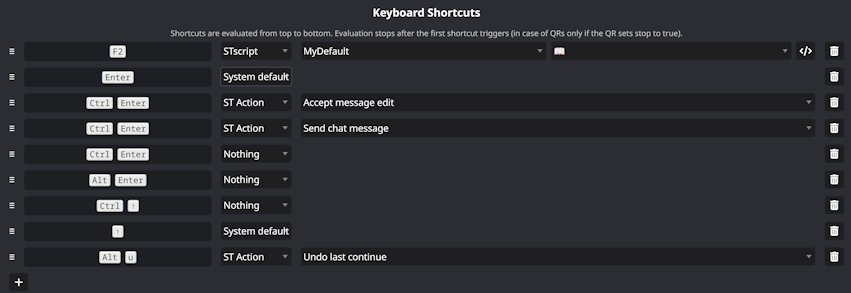

# SillyTavern - Keyboard

Assign custom keyboard shortcuts (QRs, built-in actions) and disable default shortcuts.




## Instructions

Slash command `/keyboard` to open settings.


## Extension Integration

To add custom ST Actions (direct JavaScript callbacks instead of Quick Replies), import `Callback` from `src/Callback.js` and call `Callback.add()`.

```javascript
import { Callback } from '../SillyTavern-Keyboard/src/Callback.js';

Callback.add({ id: 'send',
	label: 'Send chat message',
	check: ()=>document.activeElement.id == 'send_textarea',
	callback: async(evt)=>{
		evt.preventDefault();
		sendTextareaMessage();
	},
});
```
